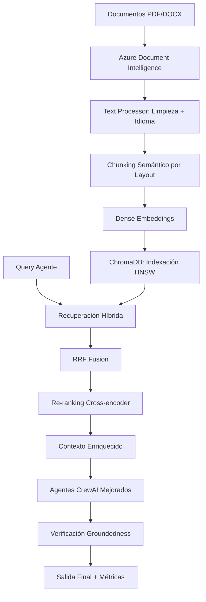

# Plan de Implementación: Arquitectura RAG Productiva

> **Basado en**: `rag_arquitectura_prompt.md` - Sistema RAG con Azure Document Intelligence + ChromaDB + CrewAI

---

## 📋 Análisis de la Situación Actual

### ✅ Componentes que SE REUTILIZAN

#### 1. **Infraestructura CrewAI Existente**
- **Archivos**: `agents/agents.py`, `tasks/task.py`
- **Agentes especializados**: Los 7 agentes actuales (3 extractores + 3 expertos + 1 concatenador)
- **Esquemas de validación**: `schemas/validation_schemas.py`
- **Configuración**: `config/settings.py`
- **Utilidades**: `utils/` (jsonl_handler, version_handler)
- **Justificación**: La lógica de negocio y extracción de variables específicas (CFA, CFX, productos, desembolsos) es valiosa y se mantiene

#### 2. **Procesamiento de Documentos con Azure Document Intelligence**
- **Archivo**: `document_intelligence_processor.py` (PARCIAL)
- **Funcionalidades a mantener**:
  - Cliente Azure Document Intelligence configurado
  - Procesamiento de PDFs, DOCX, imágenes
  - Extracción de texto y layout
  - Detección de tablas y formularios
- **Justificación**: Ya implementa Azure AI Document Intelligence Studio como requiere el prompt

#### 3. **Sistema de Chunking**
- **Archivo**: `chunking_processor.py` (MODIFICAR)
- **Funcionalidades a adaptar**:
  - Lógica de división por tokens
  - Manejo de overlaps
- **Justificación**: Base sólida para el chunking semántico requerido

#### 4. **Estructura de Tests**
- **Carpeta**: `test/`
- **Archivos**: Estructura de pytest existente
- **Justificación**: Framework de testing ya establecido

---

### ❌ Componentes que SE RETIRAN/REEMPLAZAN

#### 1. **Sistema de Chunking Actual**
- **Problema**: Chunking simple por tokens, no semántico por layout
- **Reemplazo**: Chunking semántico que respeta estructura documental (secciones, párrafos, tablas)

#### 2. **Flujo de Procesamiento Lineal**
- **Archivo**: `main.py` (REESTRUCTURAR COMPLETAMENTE)
- **Problema**: Procesamiento secuencial sin capacidades RAG
- **Reemplazo**: Pipeline RAG con indexación, recuperación híbrida y re-ranking

#### 3. **Ausencia de Sistema de Embeddings**
- **Problema**: No hay vectorización ni búsqueda semántica
- **Reemplazo**: Sistema completo con embeddings densos y ChromaDB

---

## 🏗️ Nueva Arquitectura RAG Propuesta

### 📁 Estructura de Módulos Nueva

```
rag/
├── __init__.py
├── config.py                    # Configuración RAG (embeddings, ChromaDB, etc.)
├── document_processor.py        # Ingesta con Azure Document Intelligence
├── text_processor.py           # Limpieza, normalización, detección idioma
├── chunking_semantic.py        # Chunking semántico por layout
├── embeddings_manager.py       # Embeddings densos
├── vector_store.py             # ChromaDB con HNSW
├── retriever_hybrid.py         # Recuperación híbrida + RRF
├── reranker.py                 # BAAI/bge-reranker-base
├── rag_pipeline.py             # Orquestador principal RAG
└── evaluation/
    ├── __init__.py
    ├── groundedness_checker.py  # Verificación de groundedness
    ├── metrics.py              # Métricas de evaluación
    └── observability.py        # Logging y monitoreo
```

### 🔄 Flujo de Procesamiento RAG



---

## 🎯 Plan de Implementación Detallado

### **FASE 1: Infraestructura RAG Base** (Prioridad Alta)

#### 1.1 Configuración y Dependencias
- **Archivo**: `rag/config.py`
- **Contenido**:
  - Configuración embeddings densos (normalize=True)
  - Configuración ChromaDB (HNSW: m=64, ef_search=128)
  - Parámetros de chunking (1000 tokens, overlap 100)
  - Configuración Azure Document Intelligence

#### 1.2 Procesamiento de Documentos Mejorado
- **Archivo**: `rag/document_processor.py`
- **Mejoras sobre actual**:
  - Segmentación semántica por layout
  - Detección de idioma por página/bloque
  - Corrección OCR básica
  - Preservación de metadata rica

#### 1.3 Chunking Semántico
- **Archivo**: `rag/chunking_semantic.py`
- **Funcionalidades**:
  - Respeto de límites de sección
  - Agrupación de párrafos bajo encabezados
  - Manejo de tablas y formularios
  - Metadata por chunk: `doc_id, page, section_path, lang, hash, source_type`

### **FASE 2: Sistema de Embeddings y Vectorización** (Prioridad Alta)

#### 2.1 Manager de Embeddings Densos
- **Archivo**: `rag/embeddings_manager.py`
- **Funcionalidades**:
  - Embeddings densos multilingües
  - Normalización y optimización
  - Soporte para múltiples modelos

#### 2.2 Vector Store con ChromaDB
- **Archivo**: `rag/vector_store.py`
- **Funcionalidades**:
  - Índice HNSW optimizado
  - Filtros por metadata avanzados
  - Operaciones CRUD eficientes
  - Persistencia y backup

### **FASE 3: Recuperación Híbrida y Re-ranking** (Prioridad Alta)

#### 3.1 Recuperador Híbrido
- **Archivo**: `rag/retriever_hybrid.py`
- **Funcionalidades**:
  - Búsqueda densa + dispersa simultánea
  - Fusión RRF (Reciprocal Rank Fusion)
  - Pre-filtros por metadata
  - Top-N candidatos (N=100) con trazabilidad

#### 3.2 Re-ranking con Cross-Encoder
- **Archivo**: `rag/reranker.py`
- **Funcionalidades**:
  - BAAI/bge-reranker-v2-m3 multilingüe
  - Re-ranking de top-100 a top-k final (k=5-8)
  - Scores de relevancia calibrados

### **FASE 4: Integración con Agentes CrewAI** (Prioridad Alta)

#### 4.1 Modificación de Agentes Existentes
- **Archivo**: `agents/rag_enhanced_agents.py` (NUEVO)
- **Funcionalidades**:
  - Wrapper RAG para cada agente especializado
  - Enriquecimiento de prompts con contexto RAG
  - Mantenimiento de lógica de negocio existente
  - Trazabilidad de fuentes RAG

#### 4.2 Pipeline RAG Principal
- **Archivo**: `rag/rag_pipeline.py`
- **Funcionalidades**:
  - Orquestación completa del flujo RAG
  - Integración con CrewAI
  - Manejo de errores y fallbacks
  - Logging detallado

### **FASE 5: Observabilidad y Evaluación** (Prioridad Media)

#### 5.1 Verificación de Groundedness
- **Archivo**: `rag/evaluation/groundedness_checker.py`
- **Funcionalidades**:
  - Verificación de que las respuestas estén basadas en documentos
  - Detección de alucinaciones
  - Scores de confianza

#### 5.2 Métricas y Monitoreo
- **Archivo**: `rag/evaluation/metrics.py`
- **Funcionalidades**:
  - Métricas de recuperación (Precision@K, Recall@K)
  - Métricas de generación (BLEU, ROUGE, BERTScore)
  - Latencia y throughput
  - Calidad de embeddings

---

## 📊 Comparación: Antes vs Después

| Aspecto | Sistema Actual | Sistema RAG Propuesto |
|---------|---------------|----------------------|
| **Procesamiento** | Lineal, sin contexto | RAG con recuperación semántica |
| **Búsqueda** | No existe | Semántica densa |
| **Embeddings** | No | Embeddings densos multilingües |
| **Base Vectorial** | No | ChromaDB con HNSW |
| **Re-ranking** | No | Cross-encoder |
| **Chunking** | Simple por tokens | Semántico por layout |
| **Agentes** | Procesamiento básico | Enriquecidos con contexto RAG |
| **Evaluación** | Básica | Groundedness + métricas |
| **Observabilidad** | Limitada | Completa con métricas |
| **Escalabilidad** | Baja | Alta (vectorial) |

---

## ⚡ Beneficios Esperados

### 🎯 **Precisión Mejorada**
- Extracción más precisa de variables CFA, CFX, productos, desembolsos
- Contexto semántico para mejor comprensión
- Reducción de "NO EXTRAIDO" por mejor búsqueda

### 🚀 **Escalabilidad**
- Procesamiento eficiente de grandes volúmenes documentales
- Búsqueda vectorial optimizada
- Paralelización de operaciones

### 🔍 **Trazabilidad**
- Origen exacto de cada dato extraído
- Scores de confianza por extracción
- Verificación de groundedness

### 📈 **Observabilidad**
- Métricas detalladas de rendimiento
- Monitoreo de calidad en tiempo real
- Detección proactiva de problemas

---

## 🛠️ Requerimientos Técnicos

### **Nuevas Dependencias**
```python
# Embeddings y vectorización
sentence-transformers>=2.2.2
FlagEmbedding>=1.2.0  # Dense embeddings
chromadb>=0.4.15

# Procesamiento de texto
langdetect>=1.0.9
ftfy>=6.1.1  # Corrección UTF-8

# Re-ranking
torch>=2.0.0
transformers>=4.30.0

# Evaluación
bertscore>=0.3.13
rouge-score>=0.1.2

# Observabilidad
wandb>=0.15.0  # Opcional
mlflow>=2.5.0  # Opcional
```

### **Configuración Azure**
- Mantener configuración actual de Document Intelligence
- Posible upgrade a modelo más reciente si disponible

### **Recursos Computacionales**
- GPU recomendada para embeddings densos (opcional)
- Memoria RAM: mínimo 8GB, recomendado 16GB+
- Almacenamiento: espacio adicional para ChromaDB

---

## 📅 Cronograma Estimado

| Fase | Duración | Dependencias |
|------|----------|-------------|
| **Fase 1**: Infraestructura RAG | 3-4 días | - |
| **Fase 2**: Embeddings + Vector Store | 2-3 días | Fase 1 |
| **Fase 3**: Recuperación + Re-ranking | 2-3 días | Fase 2 |
| **Fase 4**: Integración CrewAI | 3-4 días | Fase 3 |
| **Fase 5**: Observabilidad | 2-3 días | Fase 4 |
| **Testing + Ajustes** | 2-3 días | Todas |
| **TOTAL** | **14-20 días** | - |

---

## ✅ Criterios de Éxito

### **Funcionales**
- [ ] Indexación completa de documentos con metadata rica
- [ ] Recuperación híbrida funcionando con RRF
- [ ] Re-ranking mejorando relevancia de resultados
- [ ] Agentes CrewAI enriquecidos con contexto RAG
- [ ] Generación de CSVs finales con trazabilidad

### **No Funcionales**
- [ ] Latencia < 5 segundos para consultas RAG
- [ ] Precisión de extracción > 85% vs baseline actual
- [ ] Cobertura de tests > 80%
- [ ] Documentación completa de APIs
- [ ] Métricas de observabilidad implementadas

---

## 🚨 Riesgos y Mitigaciones

| Riesgo | Probabilidad | Impacto | Mitigación |
|--------|-------------|---------|------------|
| **Rendimiento embeddings** | Media | Alto | Fallback a embeddings más ligeros |
| **Compatibilidad ChromaDB** | Baja | Medio | Tests exhaustivos en Windows |
| **Integración CrewAI** | Media | Alto | Desarrollo incremental con tests |
| **Calidad de embeddings** | Baja | Alto | Evaluación continua con métricas |
| **Complejidad sistema** | Alta | Medio | Documentación detallada + modularidad |

---

**¿Apruebas este plan para proceder con la implementación?**