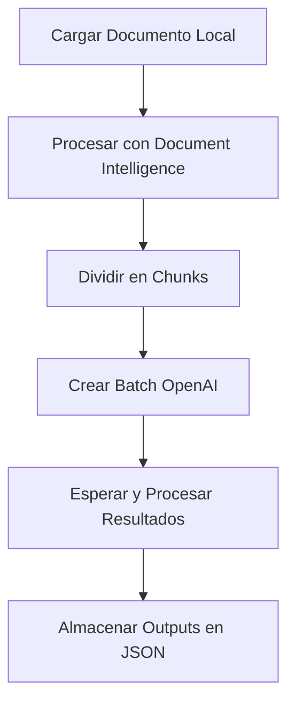
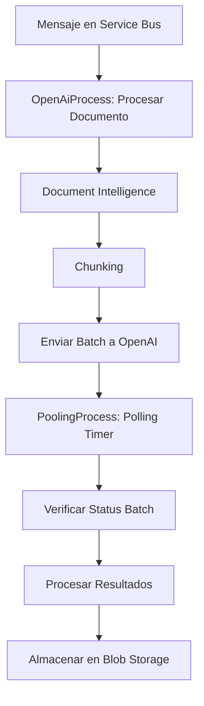

# Sistema de Procesamiento de Documentos con IA

## Descripción
Este proyecto implementa un sistema de procesamiento de documentos utilizando Azure AI Document Intelligence y Azure OpenAI para análisis inteligente. El sistema maneja documentos en formatos como PDF, extrae contenido, lo divide en chunks y aplica modelos de IA para generar resúmenes y extracciones estructuradas. Incluye componentes locales para pruebas y Azure Functions para despliegue en la nube.

### Características Principales
- Procesamiento de documentos con Azure Document Intelligence.
- División en chunks semánticos.
- Análisis batch con Azure OpenAI.
- Almacenamiento en Azure Blob Storage.
- Logging con Azure Application Insights.
- Soporte para múltiples tipos de documentos (e.g., CFA, CFB).
- Polling periódico para procesar resultados de batches.

## Arquitectura
El sistema se divide en componentes locales y en la nube:

1. **Componentes Locales** (directorio `local/`):
   - Scripts para procesamiento local y pruebas.
   - Integración con Azure services para simulación.

2. **Azure Functions** (directorio `azure_functions/`):
   - `OpenAiProcess`: Trigger por Service Bus para procesar documentos y enviar batches a OpenAI.
   - `PoolingProcess`: Timer trigger (cada 5 minutos) para verificar y procesar resultados de batches.

3. **Flujo General**:
   - Carga de documento desde Blob Storage.
   - Análisis con Document Intelligence.
   - Chunking.
   - Envío de batch a OpenAI.
   - Polling y procesamiento de resultados.
   - Almacenamiento de outputs en Blob Storage.

## Flujo de Procesamiento
1. **Carga de Documentos**: Documentos se cargan a Azure Blob Storage bajo un proyecto específico.
2. **Trigger**: Mensaje en Service Bus inicia el procesamiento (o script local).
3. **Análisis Inicial**: Usando Document Intelligence para extraer texto y estructura.
4. **Chunking**: División en chunks basados en límites de tokens, con overlap.
5. **Batch a OpenAI**: Creación de jobs batch con prompts especializados según tipo de documento (e.g., prefixes como 'IXP' para auditoría).
6. **Polling**: Verificación periódica de status de batches.
7. **Procesamiento de Resultados**: Descarga y almacenamiento de outputs en JSON.
8. **Outputs**: Archivos JSON con resúmenes, extracciones y metadatos.

## Función OpenAiProcess - Lógica Detallada

### Variables de Entrada
La función OpenAiProcess recibe mensajes de Service Bus con los siguientes campos:

**Campos Obligatorios:**
- `project_name` (string): Nombre del proyecto en Blob Storage
- `queue_type` (string): Tipo de cola para procesamiento

**Campos Opcionales:**
- `document_name` (string): Nombre específico del documento a procesar
- `document_type` (string): Tipo de documento ('Auditoria', 'Desembolsos', 'Productos')

### Variables de Entorno Requeridas
- **Azure Document Intelligence**: `AZURE_DOCUMENT_INTELLIGENCE_ENDPOINT`, `AZURE_DOCUMENT_INTELLIGENCE_KEY`
- **Azure OpenAI**: `AZURE_OPENAI_API_KEY`, `AZURE_OPENAI_ENDPOINT`, `AZURE_OPENAI_API_VERSION`, `AZURE_OPENAI_DEPLOYMENT_NAME`
- **Azure Storage**: `AZURE_STORAGE_CONNECTION_STRING`
- **Logging**: `AZURE_FUNCTIONS_ENVIRONMENT`, `WEBSITE_SITE_NAME`

### Lógica de Procesamiento

1. **Validación de Entrada**: Verifica que `project_name` y `queue_type` estén presentes
2. **Decisión de Flujo**:
   - Si `document_name` y `document_type` están presentes → `process_single_document()`
   - Si no → `process_project_documents()` (procesa todos los documentos del proyecto)

3. **Determinación de Tipo de Documento** (`determine_document_type()`):
   - **'Auditoria'**: Por defecto o si el nombre contiene palabras clave de auditoría
   - **'Desembolsos'**: Si el nombre contiene 'desembolso', 'pago', 'transferencia'
   - **'Productos'**: Si el nombre contiene 'producto', 'servicio', 'oferta'

4. **Procesamiento Individual** (`process_single_document()`):
   - Configuración del cliente Blob Storage
   - Verificación de existencia del documento
   - Descarga temporal del documento
   - Procesamiento con Document Intelligence
   - Generación de chunks
   - Envío a OpenAI Batch

### Sistema de Filtrado por Prefijos

#### Extracción de Prefijo (`_get_document_prefix()`):
- Si el nombre contiene guión: toma la parte antes del primer guión
- Si no contiene guión: toma los primeros 3 caracteres
- Convierte a mayúsculas

#### Prefijos Permitidos por Prompt:

**Prompt 1 - Auditoría:**
- Prefijos permitidos: `['IXP']`

**Prompt 2 - Productos:**
- Prefijos permitidos: `['ROP', 'INI', 'DEC', 'IFS']`

**Prompt 3 - Desembolsos:**
- Prefijos permitidos: `['ROP', 'INI', 'DEC']`

### Comportamiento Observado

1. **Procesamiento Universal**: Todos los documentos en Blob Storage se procesan con Document Intelligence
2. **Filtrado Selectivo**: Solo los documentos con prefijos permitidos generan requests a OpenAI
3. **Documentos Filtrados**: Documentos con prefijos como `IVS`, `CC1`, `RAS` se procesan con Document Intelligence pero no generan requests OpenAI
4. **Logging**: Los documentos filtrados registran el mensaje "No se generaron requests para el batch"

### Ejemplo de Flujo Completo
```
Documento: "IXP-documento-auditoria.pdf"
1. Prefijo extraído: "IXP"
2. Tipo determinado: "Auditoria"
3. Prefijo permitido para Prompt 1 (Auditoría): ✓
4. Se genera request OpenAI con prompt de auditoría

Documento: "IVS-documento-otro.pdf"
1. Prefijo extraído: "IVS"
2. Tipo determinado: "Auditoria"
3. Prefijo NO permitido para ningún prompt: ✗
4. Se procesa con Document Intelligence pero NO se envía a OpenAI
```

## Diagrama de Flujo

### Flujo Local


### Flujo en Azure Functions


## Instalación y Configuración

### Requisitos
- Python 3.8+
- Cuenta de Azure con suscripciones a: Azure OpenAI, Document Intelligence, Blob Storage, Service Bus, Application Insights.
- Dependencias: Ver `requirements.txt`.

### Pasos
1. Clona el repositorio:
   ```bash
   git clone <repo-url>
   cd Agentes_jen_rebuild
   ```
2. Instala dependencias:
   ```bash
   pip install -r requirements.txt
   ```
3. Configura variables de entorno (ver `.env.example`):
   - AZURE_OPENAI_ENDPOINT, AZURE_OPENAI_API_KEY, etc.
   - SERVICEBUS_CONNECTION_STRING, SERVICEBUS_QUEUE_NAME.
   - AZURE_DOCUMENT_INTELLIGENCE_ENDPOINT, AZURE_DOCUMENT_INTELLIGENCE_KEY.
   - APPLICATIONINSIGHTS_CONNECTION_STRING para logging.

## Estructura del Proyecto
- **azure_functions/**: Funciones de Azure para procesamiento en la nube.
  - **OpenAiProcess/**: Procesamiento inicial y envío a OpenAI.
    - `__init__.py`: Función principal con trigger de Service Bus
    - `openai_batch_processor.py`: Lógica de filtrado por prefijos y batch processing
    - `chunking_processor.py`: División de documentos en chunks
    - `document_intelligence_processor.py`: Integración con Azure Document Intelligence
    - `utils/`: Utilidades específicas (blob_storage_client.py, app_insights_logger.py)
    - `schemas/`: Esquemas de validación
  - **PoolingProcess/**: Verificación periódica de batches.
  - **tests/**: Scripts de prueba y verificación.
    - `check_documents.py`: Verificación de documentos en Blob Storage
    - `send_test_message.py`: Envío de mensajes de prueba a Service Bus
    - `monitor_function_logs.py`: Monitoreo de logs en tiempo real
- **local/**: Scripts para ejecución local.
  - **utils/**: app_insights_logger.py, blob_storage_client.py, jsonl_handler.py.
  - process_and_submit_batch.py, openai_batch_processor.py, document_intelligence_processor.py.
- **prompts/**: Prompts JSON para diferentes tipos de documentos.
- **tests/**: Scripts de prueba como send_test_message_simple.py.
- **logs/**: Directorio para logs locales.
- **check_blob_content.py**: Script para verificar contenido de blobs.
- **README.md**, **.env.example**, **requirements.txt**: Documentación y configuración.

## Uso

### Ejecución Local
1. Carga un documento a Blob Storage.
2. Ejecuta `process_and_submit_batch.py` con parámetros adecuados.

Ejemplo:
```bash
python local/process_and_submit_batch.py --project_name CFA009660 --document_name IXP-documento.pdf
```

### En la Nube (Azure Functions)

#### Envío de Mensajes a Service Bus
La función OpenAiProcess se activa mediante mensajes de Service Bus con la siguiente estructura:

**Mensaje para procesar un documento específico:**
```json
{
  "project_name": "CFA009660",
  "queue_type": "processing",
  "document_name": "IXP-documento-auditoria.pdf",
  "document_type": "Auditoria"
}
```

**Mensaje para procesar todos los documentos de un proyecto:**
```json
{
  "project_name": "CFA009660",
  "queue_type": "processing"
}
```

#### Ejemplos de Uso con Scripts de Prueba

**Enviar mensaje de prueba:**
```bash
python azure_functions/tests/send_test_message.py CFA009660 processing
```

**Verificar documentos en Blob Storage:**
```bash
python azure_functions/tests/check_documents.py
```

**Monitorear logs en tiempo real:**
```bash
python azure_functions/tests/monitor_function_logs.py
```

#### Despliegue
- Despliega las Azure Functions usando los scripts proporcionados:
```bash
./azure_functions/deploy_functions.sh
```

## Tipos de Documentos Soportados
- CFA: Documentos financieros tipo A.
- CFB: Documentos financieros tipo B.
- Otros configurables vía prompts.

## Prompts Especializados
Prompts en `prompts/` como `CFA_prompt.json` definen el análisis (e.g., extracción de secciones, resúmenes).

## Estructura de Output JSON
Los resultados incluyen:
- Resúmenes por chunk.
- Extracciones estructuradas (e.g., tablas, entidades).
- Metadatos de procesamiento.

## Configuración Avanzada
- Variables de entorno clave: AZURE_OPENAI_ENDPOINT, SERVICEBUS_CONNECTION_STRING, etc.
- Ajusta chunk sizes en chunking_processor.py.

## Logging
Usa Application Insights para logs estructurados. Configura INSTRUMENTATION_KEY.

## Pruebas
- Ejecuta scripts en `tests/` para simular mensajes y verificar flujos.
- Ejemplo: `python tests/send_test_message_simple.py <project> <doc.pdf>`

## Troubleshooting

### Problemas Comunes con OpenAiProcess

**Error: "Incorrect padding" en Blob Storage**
- Causa: Problemas con la cadena de conexión de Azure Storage
- Solución: Verificar `AZURE_STORAGE_CONNECTION_STRING` en variables de entorno

**Error: "ModuleNotFoundError: azure.functions"**
- Causa: Dependencias no instaladas
- Solución: `pip install azure-functions azure-storage-blob azure-ai-documentintelligence`

**Documentos no generan requests OpenAI**
- Causa: Prefijo del documento no está en la lista de permitidos
- Verificación: Revisar logs para mensaje "No se generaron requests para el batch"
- Solución: Verificar que el prefijo del documento esté en las listas permitidas:
  - Auditoría: `['IXP']`
  - Productos: `['ROP', 'INI', 'DEC', 'IFS']`
  - Desembolsos: `['ROP', 'INI', 'DEC']`

**Error de autenticación con Azure Services**
- Verificar todas las variables de entorno requeridas
- Confirmar que las keys y endpoints sean válidos
- Revisar permisos en Azure Portal

### Debugging General
- Revisa logs en Application Insights para debugging detallado
- Usa `monitor_function_logs.py` para logs en tiempo real
- Verifica el estado de los batches en Azure OpenAI Studio

## Métricas
Monitorea tiempos de procesamiento, tasas de error vía Insights.

## Seguridad
- No almacenes keys en código.
- Usa Azure Key Vault para producción.

## Contribuciones
Fork y PRs bienvenidos.

## Changelog
- Versión actual: Integración completa de polling y procesamiento batch.

## Licencia
MIT

## Autores
- [Tu Nombre]

## Soporte
Contacta para issues.

## Despliegue y Pruebas
- **Despliegue**: Usa scripts como deploy_functions.sh para Azure Functions.
- **Pruebas**: Scripts en `tests/` para enviar mensajes, subir documentos, monitorear logs.
- **Troubleshooting**: Verificar variables de entorno, revisar logs en Application Insights.