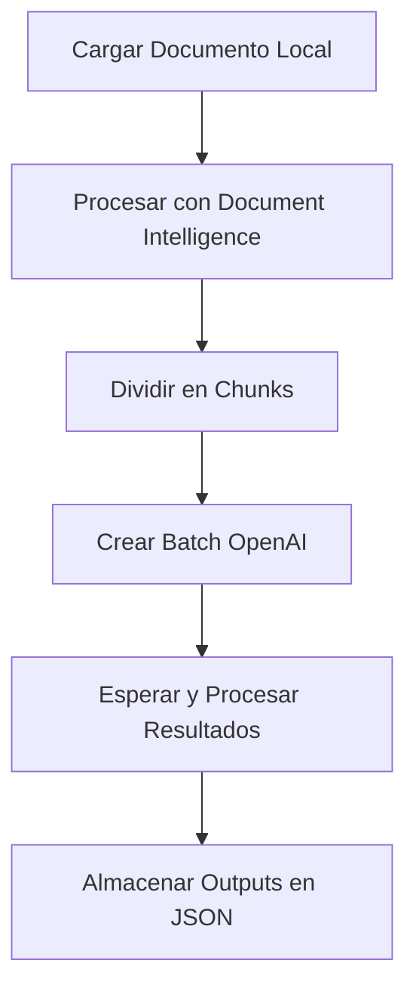
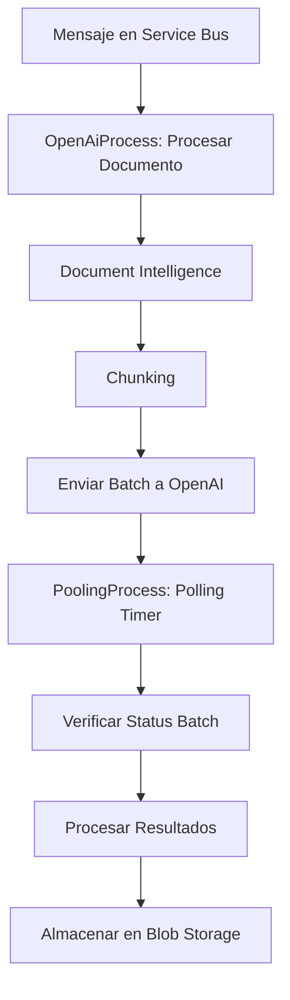

# Sistema de Procesamiento de Documentos con IA

## Descripción
Este proyecto implementa un sistema de procesamiento de documentos utilizando Azure AI Document Intelligence y Azure OpenAI para análisis inteligente. El sistema maneja documentos en formatos como PDF, extrae contenido, lo divide en chunks y aplica modelos de IA para generar resúmenes y extracciones estructuradas. Incluye componentes locales para pruebas y Azure Functions para despliegue en la nube.

### Características Principales
- Procesamiento de documentos con Azure Document Intelligence.
- División en chunks semánticos.
- Análisis batch con Azure OpenAI.
- Almacenamiento en Azure Blob Storage.
- Logging con Azure Application Insights.
- Soporte para múltiples tipos de documentos (e.g., CFA, CFB).
- Polling periódico para procesar resultados de batches.

## Arquitectura
El sistema se divide en componentes locales y en la nube:

1. **Componentes Locales** (directorio `local/`):
   - Scripts para procesamiento local y pruebas.
   - Integración con Azure services para simulación.

2. **Azure Functions** (directorio `azure_functions/`):
   - `OpenAiProcess`: Trigger por Service Bus para procesar documentos y enviar batches a OpenAI.
   - `PoolingProcess`: Timer trigger (cada 5 minutos) para verificar y procesar resultados de batches.

3. **Flujo General**:
   - Carga de documento desde Blob Storage.
   - Análisis con Document Intelligence.
   - Chunking.
   - Envío de batch a OpenAI.
   - Polling y procesamiento de resultados.
   - Almacenamiento de outputs en Blob Storage.

## Flujo de Procesamiento
1. **Carga de Documentos**: Documentos se cargan a Azure Blob Storage bajo un proyecto específico.
2. **Trigger**: Mensaje en Service Bus inicia el procesamiento (o script local).
3. **Análisis Inicial**: Usando Document Intelligence para extraer texto y estructura.
4. **Chunking**: División en chunks basados en límites de tokens, con overlap.
5. **Batch a OpenAI**: Creación de jobs batch con prompts especializados según tipo de documento (e.g., prefixes como 'IXP' para auditoría).
6. **Polling**: Verificación periódica de status de batches.
7. **Procesamiento de Resultados**: Descarga y almacenamiento de outputs en JSON.
8. **Outputs**: Archivos JSON con resúmenes, extracciones y metadatos.

## Función OpenAiProcess - Lógica Detallada

### Variables de Entrada
La función OpenAiProcess recibe mensajes de Service Bus con los siguientes campos:

**Campos Obligatorios:**
- `project_name` (string): Nombre del proyecto en Blob Storage
- `queue_type` (string): Tipo de cola para procesamiento

**Campos Opcionales:**
- `document_name` (string): Nombre específico del documento a procesar
- `document_type` (string): Tipo de documento ('Auditoria', 'Desembolsos', 'Productos')

### Variables de Entorno Requeridas
- **Azure Document Intelligence**: `AZURE_DOCUMENT_INTELLIGENCE_ENDPOINT`, `AZURE_DOCUMENT_INTELLIGENCE_KEY`
- **Azure OpenAI**: `AZURE_OPENAI_API_KEY`, `AZURE_OPENAI_ENDPOINT`, `AZURE_OPENAI_API_VERSION`, `AZURE_OPENAI_DEPLOYMENT_NAME`
- **Azure Storage**: `AZURE_STORAGE_CONNECTION_STRING`
- **Logging**: `AZURE_FUNCTIONS_ENVIRONMENT`, `WEBSITE_SITE_NAME`

### Lógica de Procesamiento

1. **Validación de Entrada**: Verifica que `project_name` y `queue_type` estén presentes
2. **Decisión de Flujo**:
   - Si `document_name` y `document_type` están presentes → `process_single_document()`
   - Si no → `process_project_documents()` (procesa todos los documentos del proyecto)

3. **Determinación de Tipo de Documento** (`determine_document_type()`):
   - **'Auditoria'**: Por defecto o si el nombre contiene palabras clave de auditoría
   - **'Desembolsos'**: Si el nombre contiene 'desembolso', 'pago', 'transferencia'
   - **'Productos'**: Si el nombre contiene 'producto', 'servicio', 'oferta'

4. **Procesamiento Individual** (`process_single_document()`):
   - Configuración del cliente Blob Storage
   - Verificación de existencia del documento
   - Descarga temporal del documento
   - Procesamiento con Document Intelligence
   - Generación de chunks
   - Envío a OpenAI Batch

### Sistema de Filtrado por Prefijos

#### Extracción de Prefijo (`_get_document_prefix()`):
- Si el nombre contiene guión: toma la parte antes del primer guión
- Si no contiene guión: toma los primeros 3 caracteres
- Convierte a mayúsculas

#### Prefijos Permitidos por Prompt:

**Prompt 1 - Auditoría:**
- Prefijos permitidos: `['IXP']`

**Prompt 2 - Productos:**
- Prefijos permitidos: `['ROP', 'INI', 'DEC', 'IFS']`

**Prompt 3 - Desembolsos:**
- Prefijos permitidos: `['ROP', 'INI', 'DEC']`

### Comportamiento Observado

1. **Procesamiento Universal**: Todos los documentos en Blob Storage se procesan con Document Intelligence
2. **Filtrado Selectivo**: Solo los documentos con prefijos permitidos generan requests a OpenAI
3. **Documentos Filtrados**: Documentos con prefijos como `IVS`, `CC1`, `RAS` se procesan con Document Intelligence pero no generan requests OpenAI
4. **Logging**: Los documentos filtrados registran el mensaje "No se generaron requests para el batch"

### Ejemplo de Flujo Completo
```
Documento: "IXP-documento-auditoria.pdf"
1. Prefijo extraído: "IXP"
2. Tipo determinado: "Auditoria"
3. Prefijo permitido para Prompt 1 (Auditoría): ✓
4. Se genera request OpenAI con prompt de auditoría

Documento: "IVS-documento-otro.pdf"
1. Prefijo extraído: "IVS"
2. Tipo determinado: "Auditoria"
3. Prefijo NO permitido para ningún prompt: ✗
4. Se procesa con Document Intelligence pero NO se envía a OpenAI
```

## Diagrama de Flujo

### Flujo Local


### Flujo en Azure Functions


## Instalación y Configuración

### Requisitos
- Python 3.8+
- Cuenta de Azure con suscripciones a: Azure OpenAI, Document Intelligence, Blob Storage, Service Bus, Application Insights.
- Dependencias: Ver `requirements.txt`.

### Pasos
1. Clona el repositorio:
   ```bash
   git clone <repo-url>
   cd Agentes_jen_rebuild
   ```
2. Instala dependencias:
   ```bash
   pip install -r requirements.txt
   ```
3. Configura variables de entorno (ver `.env.example`):
   - AZURE_OPENAI_ENDPOINT, AZURE_OPENAI_API_KEY, etc.
   - SERVICEBUS_CONNECTION_STRING, SERVICEBUS_QUEUE_NAME.
   - AZURE_DOCUMENT_INTELLIGENCE_ENDPOINT, AZURE_DOCUMENT_INTELLIGENCE_KEY.
   - APPLICATIONINSIGHTS_CONNECTION_STRING para logging.

## Estructura del repositorio (detallada)

Árbol de directorios principal y propósito de cada elemento:

```
Agentes_jen_rebuild/
├── .env.example                 # Ejemplo de variables de entorno necesarias
├── .gitignore                   # Reglas para excluir archivos sensibles y temporales
├── README.md                    # Este documento
├── azure_functions/             # Código desplegable como Azure Functions
│   ├── .funcignore              # Exclusiones para despliegue de Functions
│   ├── OpenAiProcess/           # Función (Service Bus trigger) para procesar y enviar batch a OpenAI
│   │   ├── __init__.py          # Lógica de la función (ver detalle abajo)
│   │   └── function.json        # Definición del trigger y bindings de la Function
│   ├── PoolingProcess/          # Función (Timer trigger) para hacer polling de resultados
│   │   ├── __init__.py          # Lógica de la función (ver detalle abajo)
│   │   └── function.json        # Definición del trigger y bindings de la Function
│   ├── configure_servicebus.sh  # Script para configurar Service Bus (colas, conexiones)
│   ├── deploy_functions.sh      # Script de despliegue de Functions a Azure
│   ├── host.json                # Configuración del host de Azure Functions
│   ├── prompt Auditoria.txt     # Prompt base para caso Auditoría
│   ├── prompt Desembolsos.txt   # Prompt base para caso Desembolsos
│   ├── prompt Productos.txt     # Prompt base para caso Productos
│   ├── redeploy_complete_functions.sh # Script de redeploy completo
│   ├── requirements.txt         # Dependencias Python para el entorno de Functions
│   ├── shared_code/             # Código compartido entre funciones (reutilizable)
│   │   ├── __init__.py
│   │   ├── processors/
│   │   │   ├── __init__.py
│   │   │   ├── chunking_processor.py       # Lógica de partición (chunking) de textos
│   │   │   ├── document_intelligence_processor.py # Orquesta Azure Document Intelligence + guardado
│   │   │   └── openai_batch_processor.py   # Creación de jobs batch y filtrado por prompts
│   │   ├── schemas/
│   │   │   ├── __init__.py
│   │   │   └── validation_schemas.py       # Esquemas de validación de salidas JSON
│   │   └── utils/
│   │       ├── __init__.py
│   │       ├── app_insights_logger.py      # Configuración unificada de logging (App Insights)
│   │       ├── blob_storage_client.py      # Cliente de Azure Blob Storage y rutas del proyecto
│   │       └── jsonl_handler.py            # Utilidades para manejar archivos JSONL
│   ├── tests/                   # Scripts de prueba y diagnóstico (no se despliegan)
│   │   ## Scripts de pruebas y diagnóstico (azure_functions/tests) — ampliación detallada
Además de los scripts ya documentados en esta sección, estos utilitarios te ayudan a diagnosticar despliegues en Azure y a validar la operación de extremo a extremo:

- check_azure_logs.py
  - Propósito: guía de diagnóstico para verificar el estado de la Function App y acceder rápidamente a recursos clave del portal de Azure.
  - Lógica principal:
    - Imprime los identificadores principales: Function App, Resource Group, Subscription.
    - Construye y muestra URLs directas para: Portal de Azure (recurso), Kudu Log Stream (scm), Application Insights (logs).
    - Comprueba la existencia y bindings del archivo function.json de OpenAiProcess para validar el trigger configurado.
    - Intenta hacer un GET simple a la raíz del sitio de la Function App para confirmar conectividad (sin autenticación).
    - Lista causas comunes de fallo y pasos recomendados de verificación.
  - Requisitos: acceso a internet y permisos para consultar el recurso (no requiere Azure CLI para su ejecución básica).

- monitor_function_logs.py
  - Propósito: monitoreo en tiempo (casi) real del estado de las funciones y de la cola de Azure Service Bus para validar procesamiento de mensajes.
  - Lógica principal:
    - Usa Azure CLI para:
      - Consultar el Activity Log filtrado por la Function App (últimos 10 minutos).
      - Listar funciones de la Function App y marcar si están activas o deshabilitadas.
      - Consultar la cola Service Bus (recoaudit-queue) y extraer: activeMessageCount, deadLetterMessageCount.
    - Ejecuta un bucle de ~2 minutos con verificaciones cada 15 segundos, mostrando recomendaciones según el estado de la cola.
  - Requisitos: Azure CLI instalado y autenticado (az login) con permisos sobre el Resource Group y la Function App.

- configure_azure_env.py
  - Propósito: facilitar la configuración de variables de entorno (App Settings) en la Function App a partir de un archivo .env local.
  - Lógica principal:
    - Carga variables desde azure_functions/.env (si existe) y prepara pares clave/valor relevantes para Service Bus.
    - Genera los comandos de Azure CLI correspondentes (az functionapp config appsettings set ...).
    - Permite ejecución automática de los comandos (opcional) si detecta Azure CLI disponible, o bien deja el listado para copiar/pegar.
    - Recomienda reiniciar la Function App al finalizar para aplicar los cambios.
  - Requisitos: Azure CLI instalado y autenticado; disponer de valores en el .env local.

Notas de seguridad y operación para estos scripts:
- Algunos scripts muestran identificadores de recursos en consola; evita compartir salidas sin anonimizar.
- Asegúrate de no imprimir ni registrar secretos completos (se enmascaran cuando corresponde).
- Estos scripts son auxiliares para diagnóstico; no forman parte del runtime de producción.

- check_blob_content.py
  - Propósito: verificar el contenido del Azure Blob Storage y listar documentos disponibles.
  - Lógica principal:
    - Lista todos los contenedores disponibles en la cuenta de Storage.
    - Verifica específicamente el contenedor 'caf-documents'.
    - Lista blobs con prefijo 'basedocuments/' mostrando nombre, tamaño y estructura de proyectos.
    - Genera resumen con total de documentos encontrados y proyectos identificados.
    - Incluye manejo de errores de conexión y autenticación.
  - Requisitos: AZURE_STORAGE_CONNECTION_STRING configurada.

- check_documents.py
  - Propósito: analizar documentos de un proyecto específico contra prefijos permitidos para cada prompt.
  - Lógica principal:
    - Lista todos los documentos de un proyecto específico (hardcoded: "CFA009660").
    - Extrae prefijos de nombres de documentos (parte antes del guión o primeros 3 caracteres).
    - Compara contra prefijos permitidos por prompt: Auditoría ['IXP'], Productos ['ROP', 'INI', 'DEC', 'IFS'], Desembolsos ['ROP', 'INI', 'DEC'].
    - Identifica documentos que coinciden y no coinciden con ningún prefijo permitido.
    - Genera resumen estadístico de documentos procesables vs filtrados.
  - Requisitos: acceso a BlobStorageClient y proyecto con documentos.

- configure_azure_variables.sh
  - Propósito: configurar variables de entorno críticas y opcionales en Azure Functions usando Azure CLI.
  - Lógica principal:
    - Define variables críticas (Document Intelligence, OpenAI, Storage, Service Bus) y opcionales (logging, sitio).
    - Genera comandos `az functionapp config appsettings set` para cada variable.
    - Incluye validación de existencia de variables antes de configurar.
    - Reinicia la Function App al finalizar para aplicar cambios.
    - Proporciona verificación post-configuración listando las variables configuradas.
  - Requisitos: Azure CLI instalado y autenticado, permisos sobre la Function App.

- configure_single_variable.sh
  - Propósito: configurar una variable de entorno individual en Azure Functions via línea de comandos.
  - Lógica principal:
    - Acepta argumentos: nombre de variable y valor desde línea de comandos.
    - Valida que se proporcionen ambos parámetros requeridos.
    - Ejecuta comando Azure CLI para configurar la variable específica.
    - Verifica la configuración listando la variable configurada.
    - Incluye instrucciones de uso y manejo de errores.
  - Uso: `./configure_single_variable.sh VARIABLE_NAME "variable_value"`
  - Requisitos: Azure CLI instalado y autenticado.

- diagnose_openai_variables.py
  - Propósito: diagnosticar configuración de variables OpenAI y diferencias entre OpenAiProcess y PoolingProcess.
  - Lógica principal:
    - Verifica todas las variables de entorno relacionadas con OpenAI (API_KEY, ENDPOINT, API_VERSION, DEPLOYMENT_NAME).
    - Analiza diferencias de configuración entre las dos funciones (valores por defecto diferentes).
    - Identifica problemas comunes: variables faltantes, diferencias en API version, problemas de permisos.
    - Intenta conexión real con Azure OpenAI para validar credenciales y listar batches.
    - Proporciona recomendaciones específicas para resolver problemas de configuración.
  - Requisitos: variables OpenAI configuradas, librería openai instalada.

- download_batch_info.py
  - Propósito: descargar y mostrar información detallada de archivos batch desde Azure Blob Storage.
  - Lógica principal:
    - Descarga archivos batch_info desde basedocuments/{proyecto}/processed/openai_logs/.
    - Parsea y muestra contenido JSON de cada archivo batch_info.
    - Verifica campos específicos como 'documents_info' y 'prompts_applied'.
    - Lista documentos procesados y prompts aplicados por batch.
    - Incluye manejo de errores de descarga y parsing JSON.
  - Uso: `python download_batch_info.py [PROJECT_NAME]` (por defecto: "CFA009660")
  - Requisitos: AZURE_STORAGE_CONNECTION_STRING configurada.

- fix_openai_config.sh
  - Propósito: corregir configuración específica de Azure OpenAI en Functions para resolver error 401.
  - Lógica principal:
    - Configura variables OpenAI específicas: endpoint, API key, versión API, nombre de deployment.
    - Usa valores específicos para resolver problema de endpoint incorrecto.
    - Reinicia la Function App para aplicar cambios de configuración.
    - Incluye verificación post-configuración y recomendaciones de monitoreo.
    - Diseñado específicamente para resolver error 401 causado por endpoint incorrecto.
  - Requisitos: Azure CLI instalado y autenticado, valores correctos de OpenAI.

- monitor_function_logs.py
  - Propósito: monitoreo en tiempo (casi) real del estado de las funciones y de la cola de Azure Service Bus para validar procesamiento de mensajes.
  - Lógica principal:
    - Usa Azure CLI para:
      - Consultar el Activity Log filtrado por la Function App (últimos 10 minutos).
      - Listar funciones de la Function App y marcar si están activas o deshabilitadas.
      - Consultar la cola Service Bus (recoaudit-queue) y extraer: activeMessageCount, deadLetterMessageCount.
    - Ejecuta un bucle de ~2 minutos con verificaciones cada 15 segundos, mostrando recomendaciones según el estado de la cola.
  - Requisitos: Azure CLI instalado y autenticado (az login) con permisos sobre el Resource Group y la Function App.

- configure_azure_env.py
  - Propósito: facilitar la configuración de variables de entorno (App Settings) en la Function App a partir de un archivo .env local.
  - Lógica principal:
    - Carga variables desde azure_functions/.env (si existe) y prepara pares clave/valor relevantes para Service Bus.
    - Genera los comandos de Azure CLI correspondentes (az functionapp config appsettings set ...).
    - Permite ejecución automática de los comandos (opcional) si detecta Azure CLI disponible, o bien deja el listado para copiar/pegar.
    - Recomienda reiniciar la Function App al finalizar para aplicar los cambios.
  - Requisitos: Azure CLI instalado y autenticado; disponer de valores en el .env local.

Notas de seguridad y operación para estos scripts:
- Algunos scripts muestran identificadores de recursos en consola; evita compartir salidas sin anonimizar.
- Asegúrate de no imprimir ni registrar secretos completos (se enmascaran cuando corresponde).
- Estos scripts son auxiliares para diagnóstico; no forman parte del runtime de producción.

- send_test_message.py
  - Propósito: enviar mensaje de prueba.
  - Lógica principal:
    - Envía mensaje a cola de Service Bus.

- send_test_message_simple.py
  - Propósito: enviar mensaje de prueba.
  - Lógica principal:
    - Envía mensaje a cola de Service Bus.

- upload_documents_to_blob.py
  - Propósito: cargar documentos de prueba a basedocuments/{proyecto}/raw.
  - Lógica principal:
    - Carga documentos a Blob Storage.
    - Guarda resultado (JSON/texto), sube resultado a blob (ruta arbitraria).
    - Crea archivo temporal desde blob (manejo robusto de Unicode para nombres).

2) shared_code (reutilizable por Functions)
- utils/blob_storage_client.py
  - Variables: requiere AZURE_STORAGE_CONNECTION_STRING (y opcionalmente el nombre del contenedor; por defecto caf-documents).
  - Estructura de rutas en contenedor:
    - basedocuments/{proyecto}/raw               → documentos fuente
    - basedocuments/{proyecto}/processed/DI      → salidas de Azure Document Intelligence
    - basedocuments/{proyecto}/processed/chunks  → chunks resultantes
    - basedocuments/{proyecto}/processed/openai_logs → metadatos de batches
    - basedocuments/{proyecto}/results           → resultados finales
  - Funcionalidad clave:
    - list_projects, list_raw_documents, document_exists
    - upload_raw_document, save_processed_document, load_processed_document
    - save_result (JSON/texto), upload_blob (ruta arbitraria)
    - create_temp_file_from_blob (manejo robusto de Unicode para nombres)

- utils/app_insights_logger.py
  - Inicializa un logger consistente para toda la solución.
  - Integra con Application Insights si APPLICATIONINSIGHTS_CONNECTION_STRING está configurada.

- utils/jsonl_handler.py
  - Lectura/escritura de archivos JSONL (útil para inputs/outputs de OpenAI Batch).

- processors/document_intelligence_processor.py
  - Orquesta el procesamiento con Azure Document Intelligence:
    - Por documento y por proyecto (descarga, parseo, extracción de contenido estructurado).
    - Guarda cada documento procesado en processed/DI como JSON (contenido + metadatos + json_data de DI).
    - Guarda un metadata JSON del proyecto.
    - Si auto_chunk está activo, invoca chunking_processor para generar processed/chunks.

- processors/chunking_processor.py
  - Divide textos/documentos en trozos óptimos para el modelo (límite de tokens, overlap configurable).
  - Emite lista de chunks con información de contexto (índice, rangos, fragmento de texto, etc.).

- processors/openai_batch_processor.py
  - Administra la creación de jobs batch en Azure OpenAI:
    - _setup_client: Configura cliente con AZURE_OPENAI_API_KEY/ENDPOINT/API_VERSION/DEPLOYMENT_NAME.
    - _load_prompts: Carga los contenidos de los prompts desde archivos .txt.
    - _get_document_prefix y _should_process_with_prompt: Reglas de filtrado por prefijos/tipos.
    - _create_batch_request: Construye la petición para /chat/completions (una por prompt/documento/chunk).
    - create_batch_job(project_name):
      - Recorre processed/DI y processed/chunks del proyecto.
      - Prepara archivo .jsonl temporal con todas las requests.
      - Sube el input a OpenAI y crea el batch (window 24h) con metadata del proyecto.
      - Guarda un batch_info_*.json en processed/openai_logs.
    - process_chunks: Crea un batch directamente desde una lista de chunks en memoria.

3) local (ejecución local)

### Scripts Principales
- **process_and_submit_batch.py**
  - Propósito: script principal para procesamiento completo local de documentos.
  - Lógica principal:
    - Configura logging y clientes de Azure (Document Intelligence, Blob Storage, OpenAI).
    - Procesa documentos con Document Intelligence y genera chunks.
    - Crea y envía batch jobs a Azure OpenAI.
    - Incluye funciones de setup y manejo de directorios de trabajo.
  - Uso: procesamiento local de proyectos completos.

- **results.py**
  - Propósito: monitoreo y procesamiento de resultados de batches OpenAI.
  - Lógica principal:
    - Clase `BatchResultsProcessor` para gestionar el ciclo de vida de batches.
    - Métodos para verificar estado, esperar completación y descargar resultados.
    - Procesamiento de archivos JSONL de resultados y guardado en Blob Storage.
    - Manejo de reintentos y logging detallado.
  - Uso: monitoreo local de batches en progreso.

### Procesadores Locales
- **document_intelligence_processor.py**
  - Versión local del procesador de Document Intelligence.
  - Funcionalidades similares a la versión de shared_code pero optimizada para ejecución local.
  - Incluye configuración de logging específica para entorno local.

- **chunking_processor.py**
  - Procesador local para división de documentos en chunks.
  - Implementa algoritmos de chunking con límites de tokens y overlap configurable.
  - Optimizado para procesamiento batch local.

- **openai_batch_processor.py**
  - Versión local del procesador de batches OpenAI.
  - Incluye las mismas reglas de filtrado por prefijos que la versión de Azure Functions.
  - Configuración específica para entorno de desarrollo local.

### Estructura de Soporte
- **schemas/**
  - `validation_schemas.py`: esquemas de validación para outputs JSON.
  - Definiciones de estructura esperada para resultados de procesamiento.

- **utils/**
  - `app_insights_logger.py`: configuración de logging para Application Insights.
  - `blob_storage_client.py`: cliente local de Azure Blob Storage.
  - `jsonl_handler.py`: utilidades para manejo de archivos JSONL.

- **tests/**
  - `output/`: directorio para almacenar resultados de pruebas locales.
  - Espacio para outputs temporales y archivos de prueba.

### Archivos de Configuración
- **logging_config.json**
  - Configuración detallada de logging para scripts locales.
  - Niveles de log, formatos y destinos de salida.

- **prompt Auditoria.txt**, **prompt Desembolsos.txt**, **prompt Productos.txt**
  - Copias locales de los prompts utilizados en Azure Functions.
  - Permiten desarrollo y pruebas sin dependencia del entorno cloud.

### Uso del Entorno Local
1. **Desarrollo**: Permite desarrollar y probar lógica de procesamiento sin desplegar a Azure.
2. **Debugging**: Facilita la depuración con logs detallados y acceso directo a archivos.
3. **Procesamiento Batch**: Útil para procesar grandes volúmenes de documentos de forma controlada.
4. **Validación**: Verificar resultados antes de implementar cambios en producción.

## Variables de entorno (compilado)
- Azure Document Intelligence
  - AZURE_DOCUMENT_INTELLIGENCE_ENDPOINT, AZURE_DOCUMENT_INTELLIGENCE_KEY
- Azure OpenAI
  - AZURE_OPENAI_API_KEY, AZURE_OPENAI_ENDPOINT, AZURE_OPENAI_API_VERSION, AZURE_OPENAI_DEPLOYMENT_NAME
- Azure Storage
  - AZURE_STORAGE_CONNECTION_STRING, AZURE_STORAGE_CONTAINER_NAME (por defecto: caf-documents)
- Logging / App Insights
  - APPLICATIONINSIGHTS_CONNECTION_STRING, AZURE_APP_INSIGHTS_INSTRUMENTATION_KEY
- Otros
  - LOG_LEVEL, LOG_TO_FILE, LOG_FILE_PATH, LOG_TO_CONSOLE, LOG_FORMAT

Consulta .env.example para un listado con ejemplos de valores y formatos admitidos.

## Operación del proyecto (end-to-end)
- Ingesta
  - Sube documentos a basedocuments/{proyecto}/raw del contenedor configurado.
- Disparo del procesamiento
  - En nube: envía mensaje a Service Bus (OpenAiProcess) o ejecuta la Function manualmente.
  - Local: usa process_and_submit_batch.py con parámetros de proyecto/documento.
- Extracción y chunking
  - DI produce JSON estructurado por documento y metadatos del proyecto. Luego se generan chunks.
- Creación de batch en OpenAI
  - Se ensamblan requests con prompts específicos, aplicando filtros por prefijo para cada tipo.
- Polling y resultados
  - PoolingProcess consulta estados; cuando están listos, descarga/parcea el output JSONL y guarda resultados finales.
- Persistencia
  - Todos los artefactos se guardan en Blob Storage bajo la jerarquía del proyecto.

## Prácticas de seguridad y cumplimiento
- No versionar secretos: .gitignore incluye archivos locales y tests con credenciales.
- Variables sensibles siempre por entorno o Key Vault.
- Los archivos de prompts no deben incluir datos confidenciales.
- Revisión de logs: evitar registrar valores de claves o tokens.

## Despliegue y pruebas
- Despliegue a Azure Functions
  - Ejecuta ./azure_functions/deploy_functions.sh con el entorno autenticado en Azure.
- Pruebas de integración
  - Usa scripts en azure_functions/tests para validar conectividad, colas, logs y contenido de Blob.
- Monitoreo
  - Application Insights + logs de Functions para telemetría y diagnóstico.