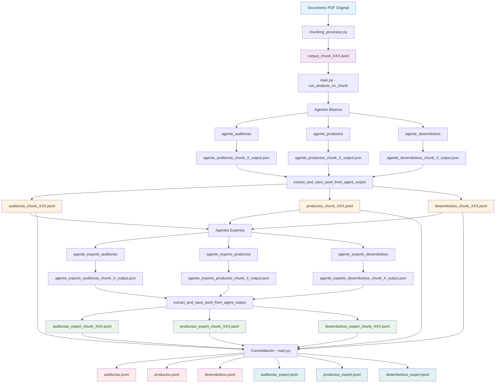

# Diagrama de Flujo - Generación de Archivos JSONL

## Flujo Completo de Generación de Archivos JSONL

## Descripción Detallada del Flujo

### 1. Procesamiento Inicial
- **Entrada**: Documento PDF original
- **Proceso**: `chunking_processor.py` divide el documento en chunks
- **Salida**: `corpus_chunk_XXX.jsonl` (datos de entrada por chunk)

### 2. Análisis con Agentes Básicos
- **Entrada**: `corpus_chunk_XXX.jsonl`
- **Proceso**: `main.py` ejecuta `run_analysis_on_chunk`
- **Agentes**: 
  - `agente_auditorias`
  - `agente_productos`
  - `agente_desembolsos`
- **Salida JSON**: 
  - `agente_auditorias_chunk_X_output.json`
  - `agente_productos_chunk_X_output.json`
  - `agente_desembolsos_chunk_X_output.json`

### 3. Extracción de Datos Básicos
- **Función**: `extract_and_save_jsonl_from_agent_output`
- **Entrada**: Archivos JSON de agentes básicos
- **Salida JSONL Básica**:
  - `auditorias_chunk_XXX.jsonl` (datos extraídos, muchos "NO EXTRAIDO")
  - `productos_chunk_XXX.jsonl` (datos extraídos, muchos "NO EXTRAIDO")
  - `desembolsos_chunk_XXX.jsonl` (datos extraídos, muchos "NO EXTRAIDO")

### 4. Análisis con Agentes Expertos
- **Entrada**: Archivos JSONL básicos específicos por tipo
- **Agentes Expertos**:
  - `agente_experto_auditorias` → recibe solo `auditorias_chunk_XXX.jsonl`
  - `agente_experto_productos` → recibe solo `productos_chunk_XXX.jsonl`
  - `agente_experto_desembolsos` → recibe solo `desembolsos_chunk_XXX.jsonl`
- **Salida JSON**:
  - `agente_experto_auditorias_chunk_X_output.json`
  - `agente_experto_productos_chunk_X_output.json`
  - `agente_experto_desembolsos_chunk_X_output.json`

### 5. Extracción de Datos Expertos
- **Función**: `extract_and_save_jsonl_from_agent_output`
- **Entrada**: Archivos JSON de agentes expertos
- **Salida JSONL Experta**:
  - `auditorias_expert_chunk_XXX.jsonl` (datos normalizados + concepto_final + concepto_rationale)
  - `productos_expert_chunk_XXX.jsonl` (datos normalizados + concepto_final + concepto_rationale)
  - `desembolsos_expert_chunk_XXX.jsonl` (datos normalizados + concepto_final + concepto_rationale)

### 6. Consolidación Final
- **Proceso**: `main.py` consolida todos los chunks
- **Archivos Finales Básicos**:
  - `auditorias.jsonl` (consolidación de todos los `auditorias_chunk_XXX.jsonl`)
  - `productos.jsonl` (consolidación de todos los `productos_chunk_XXX.jsonl`)
  - `desembolsos.jsonl` (consolidación de todos los `desembolsos_chunk_XXX.jsonl`)
- **Archivos Finales Expertos**:
  - `auditorias_expert.jsonl` (consolidación de todos los `auditorias_expert_chunk_XXX.jsonl`)
  - `productos_expert.jsonl` (consolidación de todos los `productos_expert_chunk_XXX.jsonl`)
  - `desembolsos_expert.jsonl` (consolidación de todos los `desembolsos_expert_chunk_XXX.jsonl`)

## Nomenclatura de Archivos

### Archivos de Entrada
- `corpus_chunk_XXX.jsonl` - Datos del documento dividido en chunks

### Archivos de Salida de Agentes (JSON)
- `agente_{tipo}_chunk_{X}_output.json` - Salida cruda de agentes básicos
- `agente_experto_{tipo}_chunk_{X}_output.json` - Salida cruda de agentes expertos

### Archivos JSONL por Chunk
- `{tipo}_chunk_XXX.jsonl` - Datos básicos extraídos por chunk
- `{tipo}_expert_chunk_XXX.jsonl` - Datos expertos normalizados por chunk

### Archivos JSONL Consolidados
- `{tipo}.jsonl` - Consolidación de datos básicos
- `{tipo}_expert.jsonl` - Consolidación de datos expertos

**Donde {tipo} puede ser**: `auditorias`, `productos`, `desembolsos`

## Diferencias Clave en el Contenido

### Archivos Básicos
- Contienen muchos campos con "NO EXTRAIDO"
- Datos extraídos directamente sin procesamiento adicional
- Estructura básica según el esquema de cada task

### Archivos Expertos
- Datos normalizados y enriquecidos
- Incluyen campos adicionales:
  - `concepto_final`: Análisis consolidado
  - `concepto_rationale`: Justificación del análisis
- Menos campos con "NO EXTRAIDO"
- Mayor calidad y completitud de datos

## Ubicación de Archivos
Todos los archivos JSONL se generan en: `output_docs/{CFA_CODE}/agents_output/`